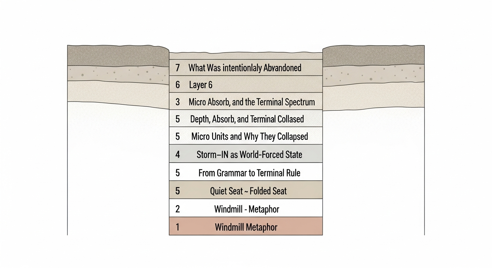

# ARCHAEOLOGY — Discovery Log of the V7 Grammar System

> *This document is a **field record**, not a design spec.*
> *It preserves the **reasoning paths, failed hypotheses, intermediate metaphors, and experimental detours** that led to the final structures declared in `STATUS.md`.*
>
> **STATUS.md answers *what is true*.**
> **ARCHAEOLOGY.md records *how we found it*.**

---

## How to Read This

* This file is **non-normative**. Nothing here defines rules.
* Concepts may be redundant, superseded, or partially wrong.
* Every section links forward to the **final structure** it helped uncover.

Think of this as a dig site: layers matter more than polish.

---

## 0. Map



1. [Windmill Metaphor](#1-windmill-metaphor)
2. [Quiet Seat → Folded Seat](#2-quiet-seat--folded-seat)
3. [Storm-IN as World-Forced State](#3-storm-in-as-world-forced-state)
4. [From Grammar to Terminal Rule](#4-from-grammar-to-terminal-rule)
5. [Micro Units and Why They Collapsed](#5-micro-units-and-why-they-collapsed)
6. [Depth, Absorb, and the Terminal Spectrum](#6-depth-absorb-and-the-terminal-spectrum)
7. [What Was Intentionally Abandoned](#7-what-was-intentionally-abandoned)

Each section ends with **→ Resolved As:** linking to `STATUS.md`.

---

## 1. Windmill Metaphor

**Initial intuition**

> *"We are not predicting wind. We are fixing the place where rotation happens."*

Windmill was never a trading rule. It was a **constraint metaphor**:

* No direction knowledge
* No magnitude forecasting
* Only: *does rotation occur here or not?*

This metaphor survived multiple experimental failures because it encoded one invariant:

> **Only post-collapse observation is meaningful.**

→ **Resolved As:** `Storm-IN` + `Terminal observation` in `STATUS.md`

---

## 2. Quiet Seat → Folded Seat

### Quiet Seat (Failed)

* Hypothesis: low volatility = safety
* Result: weak effect, non-forced

### Folded Seat (Partial)

* Hypothesis: compression before release
* Result: worked operationally, failed world-forced tests

Key realization:

> A *seat* is not a coordinate. A seat is what remains when coordinates are removed.

→ **Resolved As:** Seats are not primitives; **Terminal states are**

---

## 3. Storm-IN as World-Forced State

Storm-IN was the **first structure that survived every distortion test**:

* Time shuffle
* Feature ablation
* Regime split

It never imposed direction.
It only amplified whatever regime already existed.

> *Storm-IN does not decide.*
> *Storm-IN exposes.*

→ **Resolved As:** `Macro Storm-IN (Field)` in `STATUS.md`

---

## 4. From Grammar to Terminal Rule

### Grammar Phase

We temporarily modeled micro behavior as sentences:

```
<DIR, COMMIT, PATH>
```

Eight valid combinations emerged.
But distortion tests revealed:

* Shuffling grammar axes changed nothing
* Removing axes changed nothing

What remained invariant:

> **E_RESP → Absorb**

Grammar collapsed.
Terminal rule survived.

→ **Resolved As:** `Terminal Rule is universal` in `STATUS.md`

---

## 5. Micro Units and Why They Collapsed

We identified multiple micro units:

* FAST-UP-V
* DELAYED-UP-STAIR
* FAST-DOWN-V
* Absorb

They felt real.
They traded differently.

But none of them:

* altered terminal probability
* survived ablation as a class

They were **flavors, not laws**.

→ **Resolved As:** Micro classification is descriptive, not structural

---

## 6. Depth, Absorb, and the Terminal Spectrum

Depth was first treated as:

* a coordinate
* then a cumulative axis

Both failed.

What survived:

* Depth as **outcome**, not state
* Absorb as **terminal basin**

Terminal spectrum emerged:

```
Soft → Absorb → Hard
```

Hard terminal revealed itself as **HTF frame switch**, not micro failure.

→ **Resolved As:** `Terminal Spectrum` in `STATUS.md`

---

## 7. What Was Intentionally Abandoned

These were explored and **consciously dropped**:

* Predictive alpha selection
* Direction-first logic
* Continuous depth coordinates
* Grammar as execution logic

Reason:

> They explained *what happens*, not *when meaning exists*.

---

## Closing Note

This document exists so that future readers do not mistake the final structure
for something that appeared fully formed.

It didn't.

It was excavated.

---

**See also:**

* [`STATUS.md`](STATUS.md) — Final, binding structure
* [`SIMPLE_GUIDE.md`](docs/SIMPLE_GUIDE.md) — How to observe without prediction
