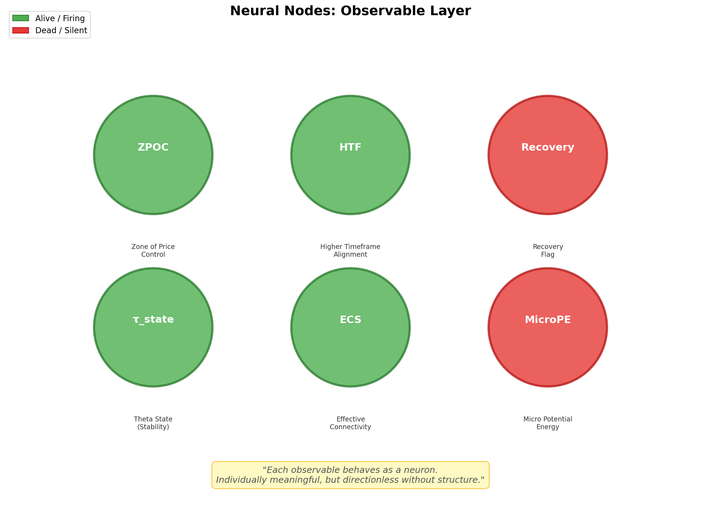
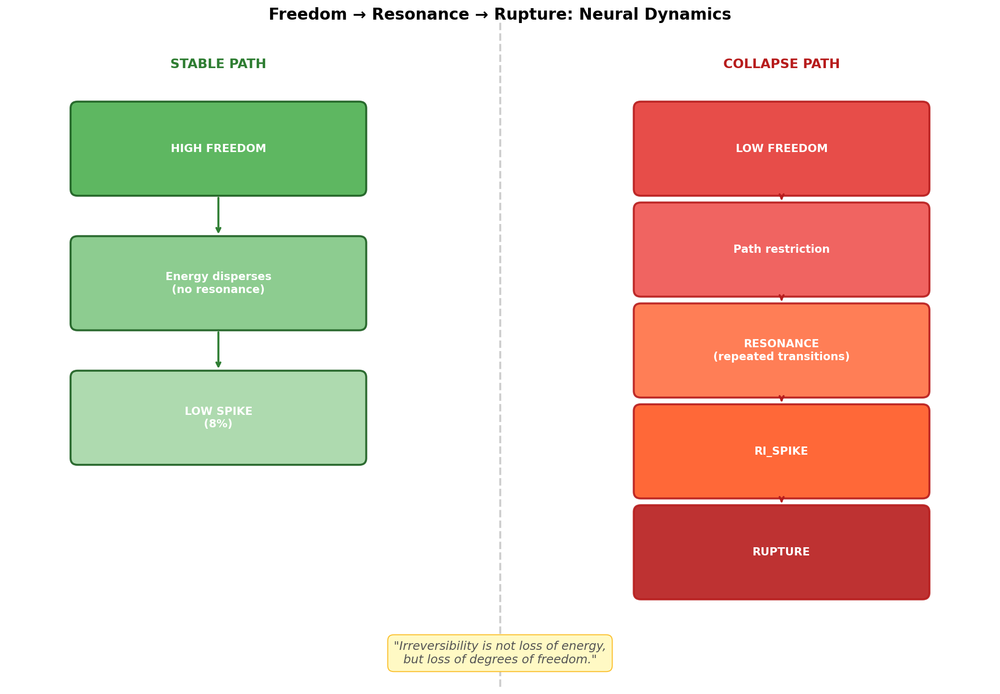
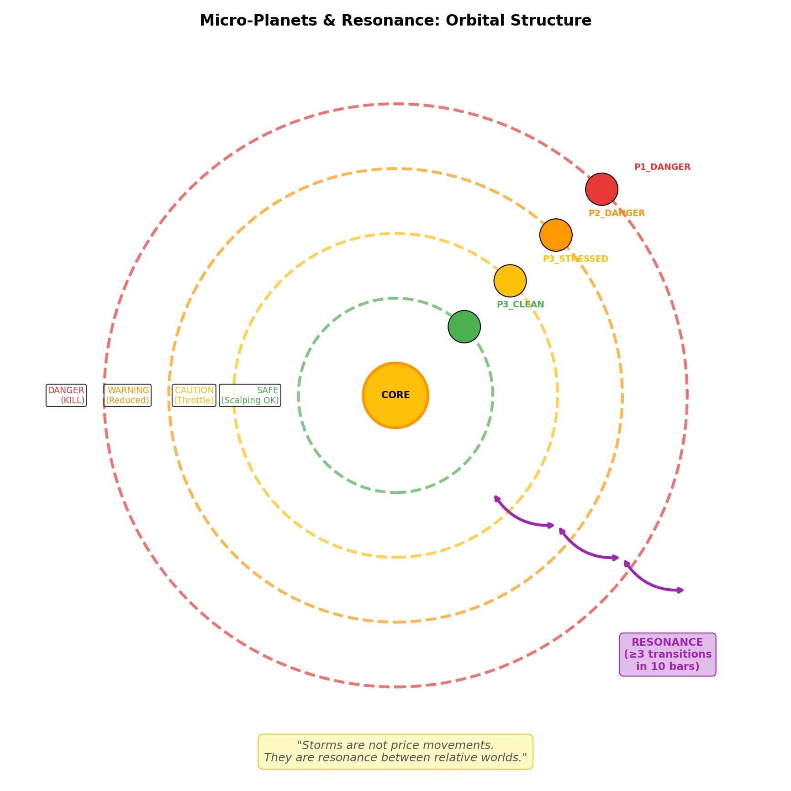

# Neural Interpretation of the System

> **This system is not metaphorically, but structurally neural.**

We did not use neurons as a metaphor.  
We decomposed the market into a **measurable structure that behaves like neurons**.

---

## 1. Nodes (Neurons)

Each observable acts as a neuron with binary or graded firing:

| Observable | Role | State |
|------------|------|-------|
| `ZPOC_alive` | Zone of Price Control presence | Binary |
| `HTF_alive` | Higher Timeframe alignment | Binary |
| `Recovery` | Recovery flag after stress | Binary |
| `τ_state` | Theta stability state | Graded |
| `ECS_component` | Effective connectivity contribution | Graded |
| `MicroPE` | Micro potential energy sign | Signed |

> **Each neuron fires independently, but has no direction alone.**



---

## 2. Synapses (Connectivity)

Neurons interact through:

| Metric | Meaning |
|--------|---------|
| **ECS** | Effective Connectivity Score |
| **IE** | Intersection Energy |
| **Alive Count** | Number of active nodes |

### The U-Curve Law

Both under- and over-connection are unstable.

| Condition | Connectivity | Risk |
|-----------|--------------|------|
| Isolation | IE < 2.3 | HIGH |
| Optimal | IE 2.3 ~ 3.8 | LOW |
| Overload | IE > 3.8 | HIGH |

> **Stability emerges only under moderate connectivity.**
> **Both isolation and over-connection are lethal.**


---

## 3. Neural Dynamics

System-level behavior emerges from:

| Concept | Neural Analogue |
|---------|-----------------|
| **Freedom Index** | Degrees of freedom in neural state space |
| **Resonance** | Repeated path activation under constraint |
| **RI (Rupture Index)** | Force concentration / neural pressure |
| **World Transition** | Phase shift between neural attractors |

### The Causal Chain

```
HIGH FREEDOM
    ↓
Energy disperses (no resonance)
    ↓
LOW SPIKE (8%)

---

LOW FREEDOM
    ↓
Path restriction
    ↓
RESONANCE (repeated transitions)
    ↓
RI_SPIKE
    ↓
RUPTURE
```

> **Storms correspond to neural seizure-like states:**
> **Energy persists, freedom collapses.**



---

## 4. Planetary Resonance

Markets exhibit **micro-planet** structure with orbital dynamics:

| Planet | Stability | Action |
|--------|-----------|--------|
| **P3_CLEAN** | Stable | Scalping allowed |
| **P3_STRESSED** | Caution | Throttle |
| **P2_DANGER** | Warning | Reduced action |
| **P1_DANGER** | Critical | KILL |

### Resonance = Rapid Inter-Planetary Transit

When a system transitions between 3+ planets within 10 bars:
- Path diversity collapses
- Energy concentrates
- SPIKE probability increases ×2.3

> **Storms are not price movements.**
> **They are resonance between relative worlds.**



---

## 5. Summary: Why This Structure Matters

This is not:
- ❌ A trading strategy
- ❌ A prediction model
- ❌ A metaphor for explanation

This is:
- ✅ A structural interpretation of market observables
- ✅ A measurable decomposition into neural-like units
- ✅ A safety layer that identifies when trading becomes meaningless

---

## 6. The Core Insight

> **"We do not trade prices.**
> **We observe whether the neural network is healthy."**

| State | Interpretation |
|-------|----------------|
| High Freedom + Moderate Connectivity | Healthy network, trading allowed |
| Low Freedom + Resonance | Seizure-like state, trading prohibited |
| Collapsed Freedom | Dead network, no valid price discovery |

---

## Final Statement

> **We did not use neurons as a metaphor.**
>
> **We decomposed the market into a measurable structure**
> **that behaves like a neural network.**
>
> **Observables are neurons.**
> **Connectivity defines synaptic health.**
> **Freedom collapse corresponds to loss of neural degrees.**
> **Resonance is repeated path excitation under constrained freedom.**

---

*This document preserves the structural interpretation of the V7 Grammar System.*
*It is not a strategy guide but a design philosophy record.*
