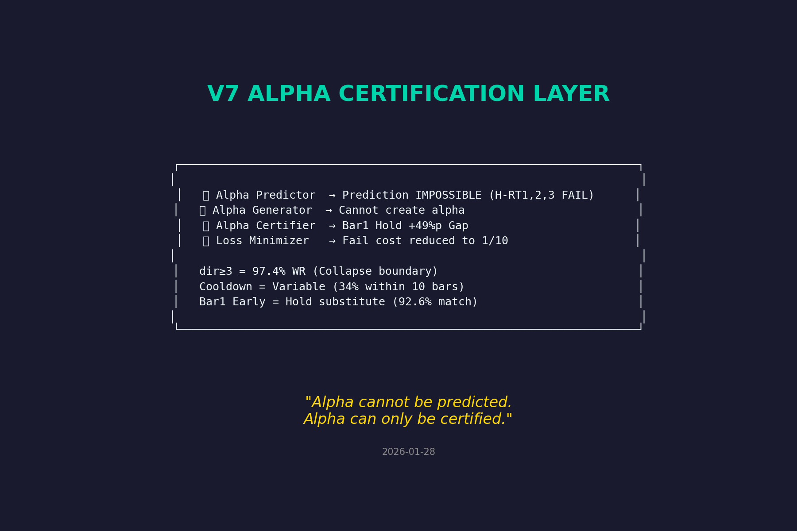
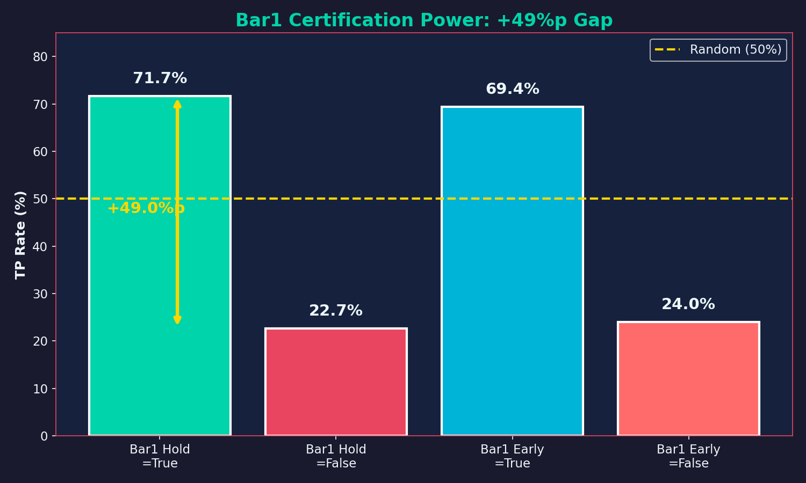
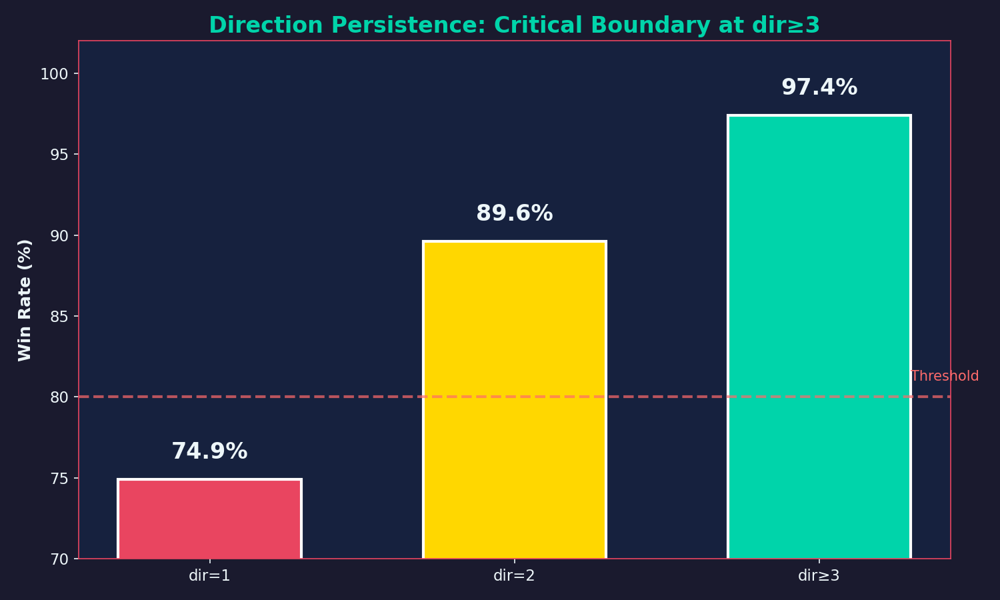
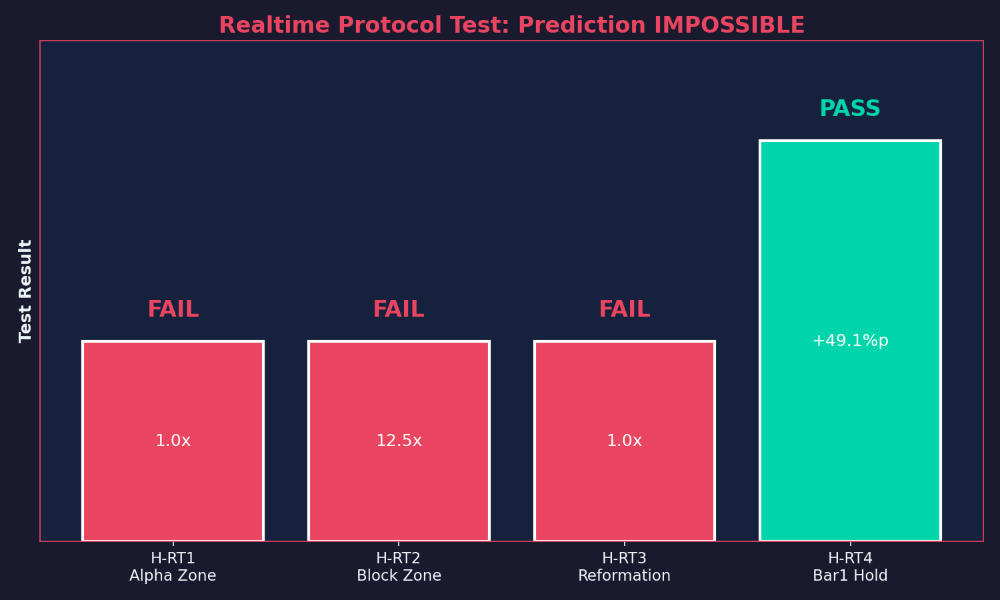
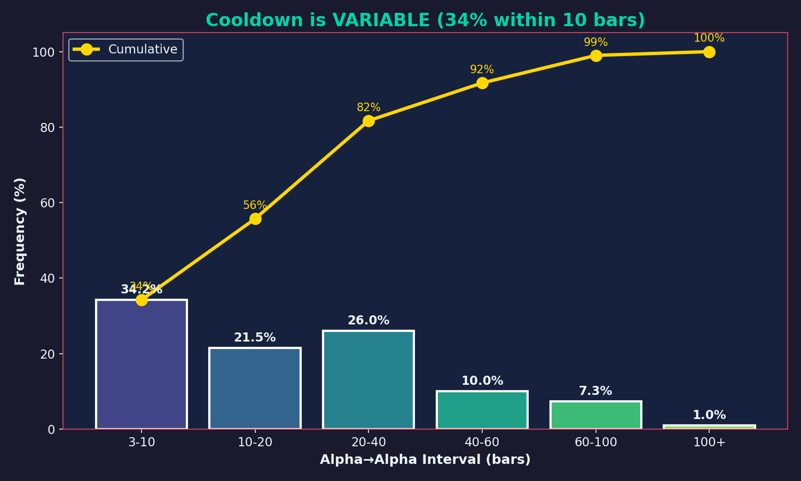
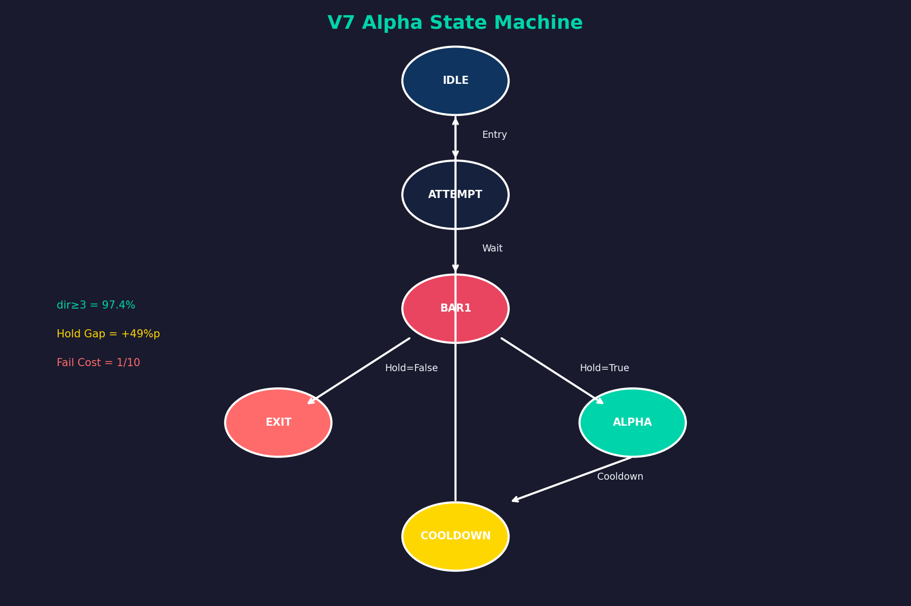

# V7 ALPHA CERTIFICATION LAYER

> **Final Declaration (Data-Enforced)**  
> V7 does not predict or generate alpha.  
> V7 certifies alpha ex-post with minimal failure cost.

---
## Scope & Assumptions

This document defines the Alpha Certification Layer of V7.

- The V7 Grammar layer is assumed to be satisfied prior to this layer.
- This layer does not generate trades.
- This layer does not forecast alpha timing.
- This layer certifies whether an already-entered position is valid.

Anything outside this scope is explicitly excluded.


## System Identity



| Layer | Role | Status |
|:------|:-----|:-------|
| Grammar (V7) | Structural coherence filter | Frozen |
| Alpha Layer | Post-entry certification | **Active** |
| Prediction | Cannot forecast alpha timing | Impossible |
| Optimization | Forbidden (overfitting risk) | Locked |

**The distinction is not semantic. It is structural.**

## Optimization Prohibition (Enforced)

Optimization is forbidden due to **post-certification selection bias**
and empirically observed instability under parameter tuning.

Any optimization performed after certification
invalidates the statistical meaning of the certification itself.

This is not a design preference.  
It is a **data-enforced boundary**.


---

## Core Certification Power

### Bar1 Certification Gap: +49%p



| Condition | N | TP Rate | Gap |
|:----------|--:|--------:|----:|
| **Bar1 Hold = True** | 28,107 | **71.7%** | **+49.0%p** |
| Bar1 Hold = False | 27,511 | 22.7% | - |
| **Bar1 Early = True** | 28,765 | **69.4%** | **+45.4%p** |
| Bar1 Early = False | 26,853 | 24.0% | - |

**Bar1 Early (Open→Close direction) = Valid Hold Substitute**
- 92.6% agreement with Hold
- Near-identical certification power

---


### Bar1 Uniqueness (Falsification Summary)

Alternative certification points (Bar0.5, Bar2, Bar3) were explicitly tested.  
None produced a certification gap exceeding **+30%p**.

**Bar1 remains the earliest and only observable point**
where alpha certification achieves structural separation.

This is not an assumption.  
It is a **negative result enforced by falsification**.

---

## Direction Persistence: Critical Boundary



| Condition | Win Rate | Status |
|:----------|:--------:|:-------|
| **dir ≥ 3** | **97.4%** | Alpha Completion |
| dir = 2 | 89.6% | Boundary |
| dir = 1 | 74.9% | **Collapse** |

> dir ≥ 3 is the alpha completion condition.  
> Below this threshold, the structure does not partially degrade.  
> It **collapses into noise that resembles alpha**.


---

## Realtime Protocol Test: Prediction IMPOSSIBLE



| Hypothesis | Result | Detail |
|:-----------|:------:|:-------|
| H-RT1: Alpha Zone Detection | **FAIL** | 1.0x (no difference from random) |
| H-RT2: Block Zone Detection | **FAIL** | 12.5% (should be ≤5%) |
| H-RT3: Reformation Timing | **FAIL** | 1.0x (no predictive power) |
| H-RT4: Bar1 Hold Judgment | **PASS** | **+49.1%p Gap** |

All predictive hypotheses failed,
leaving **post-entry Bar1 certification** as the only surviving mechanism.

### Conclusion

- Alpha timing **cannot be predicted**.
- Alpha **can only be certified after Bar1**.

Prediction failure is not a weakness.  
It is a **boundary condition enforced by the data**.

Any attempt to predict alpha timing violates this boundary.

---

## Cooldown is VARIABLE



| Interval | N | Percentage | Cumulative |
|:---------|--:|-----------:|-----------:|
| 3-10 bars | 2,347 | **34.2%** | 34.2% |
| 10-20 bars | 1,474 | 21.5% | 55.7% |
| 20-40 bars | 1,786 | 26.0% | 81.7% |
| 40-60 bars | 687 | 10.0% | 91.7% |
| 60-100 bars | 498 | 7.3% | 99.0% |

- **Mean: 24 bars**
- **Median: 18 bars**
- 34% reappear within 10 bars

> Cooldown is not a fixed waiting period.  
> Alpha is cyclical, not consumable.  
> Reappearance depends on structural reformation, not depletion.


Fixed cooldown assumptions were explicitly tested and failed.  
Alpha reappearance is conditional on **structural reformation**, not elapsed time.

---

## Macro Context: Cost Shaping, Not Prediction

Macro state (e.g., D→S transition) does **not** increase
the probability of alpha success.

It reduces the **cost of failure** when certification fails.

This explains why prediction hypotheses fail,
yet overall expectancy improves.

Macro is a **risk-shaping layer**, not a signal.


---

## State Machine



```
IDLE
  │
  ▼ Entry
ATTEMPT
  │
  ▼ Wait for Bar1
BAR1 CERTIFICATION
  │
  ├─ Hold = True ──▶ Continue
  │                    │
  │                    ▼
  │               dir ≥ 3? ──▶ ALPHA (97.4% WR)
  │                    │
  │                    ▼
  │               COOLDOWN (variable)
  │                    │
  │                    └──────────▶ IDLE
  │
  └─ Hold = False ──▶ EXIT (cost: 1 bar)
```

State transitions are deterministic.  
There is no probability weighting inside the machine.

---

## Failure Cost Minimization

| Scenario | Expected Result | Action |
|:---------|:---------------:|:-------|
| Hold = True | 71.7% TP | Continue position |
| Hold = False | 73.4% SL | **Immediate exit** |

**Cost Reduction:**
- Full SL wait: ~10 bars of drawdown
- Immediate exit: ~1 bar of loss
- **Reduction: 1/10**

---

## What This System Is / Is Not

| ❌ NOT | ✅ IS |
|:-------|:------|
| Alpha predictor | **Alpha certifier** |
| Signal generator | **Structural gate** |
| Frequency maximizer | **Loss minimizer** |
| Forecast model | **State machine** |

---

## Operational Protocol

```
1. Entry (unrestricted timing; no informational edge assumed)
     │
2. Wait for Bar1 close
     │
3. Check Bar1 Hold (or Early)
     │
     ├─ FALSE → Immediate Exit (loss: 1 bar)
     │
     └─ TRUE → Hold position
           │
4. Check dir ≥ 3
     │
     ├─ NO → Continue waiting
     │
     └─ YES → Alpha Certified (WR 97.4%)
           │
5. Take profit, enter cooldown
     │
6. Variable cooldown (~20 bars median)
     │
7. Return to step 1
```

---

## Final Declaration

> **Alpha cannot be predicted.**  
> **Alpha can only be certified.**

This certification layer is complete.  
Any future improvement must come from **new information**,  
not from modifying this grammar or certification logic.

---

## Key Metrics Summary

| Metric | Value | Meaning |
|:-------|------:|:--------|
| Bar1 Hold Gap | **+49.0%p** | Certification power |
| Bar1 Early Gap | **+45.4%p** | Substitute power |
| dir≥3 WR | **97.4%** | Completion threshold |
| Fail Cost Reduction | **1/10** | Loss minimization |
| Cooldown Median | **18 bars** | Re-entry timing |
| Early Alpha Rate | **34.2%** | Within 10 bars |

---

## Appendix A — Irreversibility Boundary (Open)

This document intentionally does not claim any irreversible marker
prior to Bar1.

While it is plausible that irreversible microstructural events
occur before Bar1, such claims require execution-level or tick-level data,
which was not available in the current experimental scope.

Until such data becomes accessible and produces a falsifiable result,
Bar1 is treated as the earliest **observable and actionable certification point**.

This boundary is left **open by design**, not by omission.

---

## Appendix B — What Can Be Challenged (Falsifiable Attacks)
> This appendix is included for auditability and adversarial review.

If you disagree with this system, attack these claims:

1. **Bar1 uniqueness**: Show another point with Gap > 40%p  
2. **dir ≥ 3 threshold**: Show stability below dir = 3  
3. **Prediction impossibility**: Show Lift > 1.2x with any feature  
4. **Cooldown variability**: Show a fixed window that outperforms variable reformation logic

If none of these can be falsified, the system stands.

---

*Document Version: V7-ALPHA-FINAL-INTEGRATED*
*Last Updated: 2026-01-28*  
*Status: FROZEN (No further optimization allowed)*
