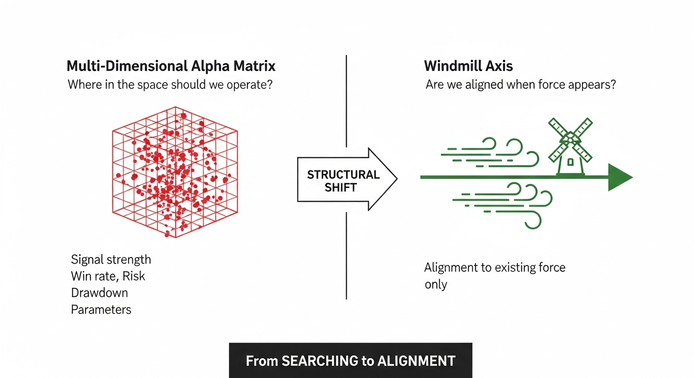

# Windmill Axis — From Multi-Dimensional Metrics to a Single Axis

## The Structural Shift

Traditional alpha research treats profitability as a problem in a **multi-dimensional metric space**:

- Signal strength
- Win rate
- Risk / Drawdown
- Regime features
- Parameter interactions

In such systems, alpha is *searched for* by navigating this space and optimizing across dimensions.

**The V7 Grammar System explicitly rejects this formulation.**

---

## What is the Windmill Axis?

Alpha is **not** searched for inside a metric space.

Instead, the system defines a **single execution axis**: the **Windmill Axis**.

```
┌─────────────────────────────────────────────────────────────────┐
│                                                                 │
│   BEFORE: Multi-Dimensional Alpha Matrix                       │
│                                                                 │
│        ┌───────────────┐                                        │
│       /│              /│     "Where in the space               │
│      / │             / │      should we operate?"              │
│     ┌───────────────┐  │                                        │
│     │   ● ●   ●     │  │     Dimensions:                       │
│     │     ●   ●  ●  │  │     - Signal, Winrate, Risk...        │
│     │  ●    ●       │ /                                         │
│     │    ●     ●    │/       Problem: Optimization hell        │
│     └───────────────┘                                           │
│                                                                 │
├─────────────────────────────────────────────────────────────────┤
│                          ↓                                      │
│                  STRUCTURAL SHIFT                               │
│                          ↓                                      │
├─────────────────────────────────────────────────────────────────┤
│                                                                 │
│   AFTER: Windmill Axis                                          │
│                                                                 │
│      Wind (Market Force)                                        │
│         ═══════════════════════════════════▶                    │
│                        ┼                                        │
│                       /│\    Windmill                           │
│                      / │ \   (responds only when wind exists)   │
│                                                                 │
│         "Are we aligned when force appears?"                    │
│                                                                 │
│         - No coordinate grid                                    │
│         - No internal performance surface                       │
│         - Only orientation to force                             │
│                                                                 │
└─────────────────────────────────────────────────────────────────┘
```

---

## Why an Axis, Not a Matrix?

A multi-dimensional alpha matrix implicitly assumes:

| Assumption | Problem |
|------------|---------|
| Value exists everywhere in the space | Overfitting trap |
| Optimization can manufacture performance | False confidence |
| Failure implies rule invalidation | System collapse |

**The Windmill Axis assumes none of this.**

| Windmill Principle | Meaning |
|--------------------|---------|
| Value exists only when the world supplies force | No wind = no rotation |
| Optimization cannot create wind | Humility built-in |
| Failure does not falsify the grammar | System survives |

---

## The Core Distinction

```
Grammar = Defines WHEN wind exists
Windmill = Defines HOW (or whether) to respond
```

**These are separated by design.**

If windmills were inside the grammar:
- Performance failure would invalidate the grammar
- World rules would become execution strategies
- The system would lose its invariant core

---

## Structural Properties of the Windmill Axis

| Property | Description |
|----------|-------------|
| **Modular** | Windmills can be attached/detached |
| **Multiple** | Several windmills may coexist |
| **Replaceable** | Windmills can fail without grammar damage |
| **External** | Optimization happens only on the axis, not in the core |

This separation enables:
- Institutional-grade auditability
- Adversarial validation
- Parallel alpha experimentation

...without corrupting the underlying decision structure.

---

## The Question Changes

**Before (Matrix Thinking):**
> "Where in the space should we operate?"

**After (Axis Thinking):**
> "Are we aligned with the axis when force appears?"

---

## Final Statement

The V7 Grammar System defines **when wind exists**.

Windmills define **how (or whether) value is extracted** from it.

**The system remains correct even if no windmill ever spins.**

---


