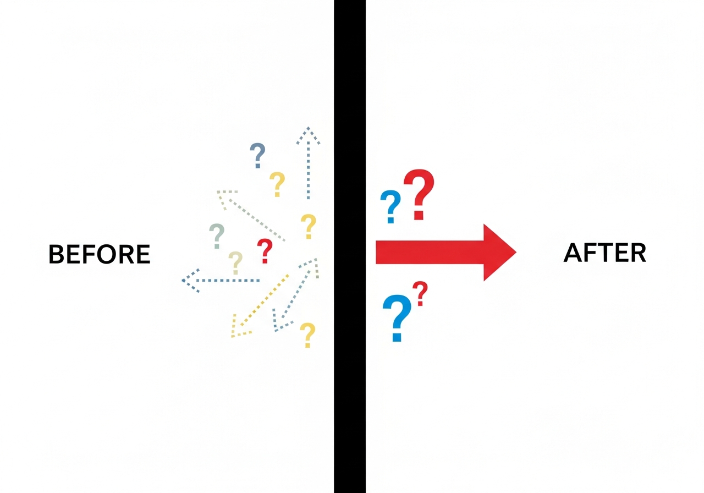

# Irreversibility

> *This document answers one specific question.*
> *It does not explain the entire system.*

---

## 🔬 Scientific Tools Used for Observation

This theory was validated using observational tools,
not predictive or optimization-based methods.

The primary tools were:

**Irreversible boundary detection**
Identifying state transitions where prior information cannot be recovered
(operationally observed at DC = 1, Bar1).

**Distributional analysis**
Comparing outcome distributions across state partitions
rather than fitting individual trajectories.

**State-space decomposition**
Representing market behavior in a multi-dimensional state space
(Pressure, Constraint, Release) instead of price-time coordinates.

**Energy conservation checks**
Verifying that aggregate force is redistributed across states
rather than created or destroyed.

**Hypothesis collapse testing**
Removing assumptions layer by layer
and retaining only structures that survive falsification.

No stochastic forecasting, curve fitting, or parameter optimization
was used to derive these conclusions.

---

## Declaration

Prediction isn't difficult because information is insufficient.
**Prediction is structurally impossible.**

This is not a limitation.
This is the starting point.

---

## How This Was Observed

This theory was not derived from prediction,
optimization, or pattern fitting.

We used:

- Large-scale post-event aggregation
- State-based grouping instead of time-series forecasting
- Irreversible boundary detection (DC=1)
- Distributional comparison across state buckets
- Hypothesis collapse testing (remove-and-survive method)

No parameter tuning was allowed.
Any hypothesis that enabled prediction was rejected.

---

## Definition of an Event



The market has a **boundary.**

| Before the boundary | After the boundary |
|:--------------------|:-------------------|
| Multiple possibilities exist | Converges to one |
| Direction unknown | Direction confirmed |
| Information not yet fixed | Cannot return to prior state |

This boundary is called **Bar1.**
Bar1 is an **Event.**

> 🔍 **Why we defined it this way**
>
> Signal occurrence was 100% only at DC=1 condition.
> This point is the boundary of irreversibility.
> No observation is definitive before crossing this boundary.
> This is an experimental result.

---

## Separating Reversible and Irreversible

| State | Characteristic |
|:------|:---------------|
| **Reversible (Pre-Bar1)** | Appears different to different observers |
| **Irreversible (Post-Bar1)** | Appears the same to everyone |

Reversible state:
- Different analyses lead to different conclusions
- Cannot claim "I'm right"
- Information **doesn't exist yet**

Irreversible state:
- One fact regardless of analysis
- Just confirm it
- Information is **already fixed**

---

## Information Loss

The moment you cross the boundary, **information needed to restore the prior state vanishes.**

This is the precise meaning of "irreversibility."

```
Irreversibility = cannot be undone
                = required information has already disappeared
                = data needed for prediction doesn't exist
```

> 🔍 **Why this is important**
>
> All real-time prediction attempts FAILED.
> This is not a skill deficiency.
> Before the irreversible boundary, information to determine the outcome doesn't exist.
> Prediction failure is not a capability problem—it's **structural impossibility.**

---

## Why Only Post-Event Observation Is Possible

Before it breaks: **no one knows.**
After it breaks: **everyone sees.**

This is not a matter of choice.
It's a **physical constraint.**

| Attempt | Result |
|:--------|:-------|
| Try to predict before it breaks | Structurally impossible |
| Confirm after it breaks | Always possible |

So we:
- Don't predict
- Confirm
- Only trust what's confirmed

---

## Core Declaration

```
┌─────────────────────────────────────────────────────────────────────┐
│                                                                     │
│  Giving up prediction is not a loss.                               │
│  Acknowledging its impossibility                                   │
│  is the starting point of this system.                             │
│                                                                     │
└─────────────────────────────────────────────────────────────────────┘
```

---

## Questions This Document Answers

**Q: Why can't we predict?**
A: Information needed for prediction doesn't exist before the boundary.

**Q: Then what can we do?**
A: We can confirm states after crossing the boundary.

**Q: Is this a flaw in the system?**
A: No. This is the design principle of the system.

---

## Scope of This Document

This document does not cover:
- Analysis possible before the boundary
- Strategies that replace prediction
- Execution layer details

This document covers only one thing:
**Why prediction is structurally impossible.**

---

*V7 Observation Theory - IRREVERSIBILITY*
