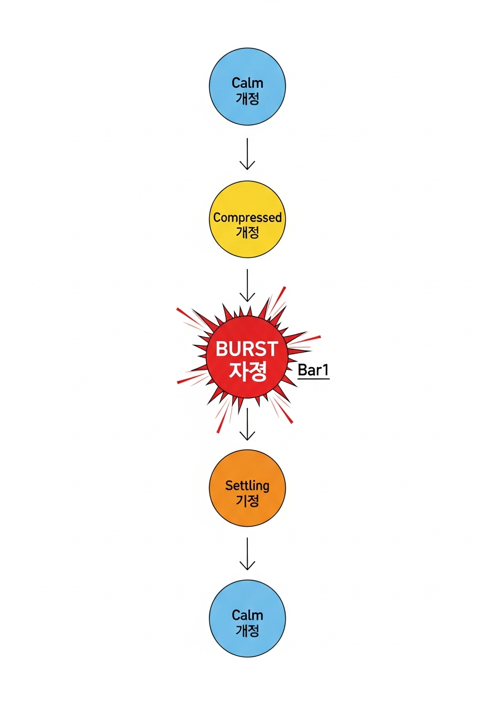
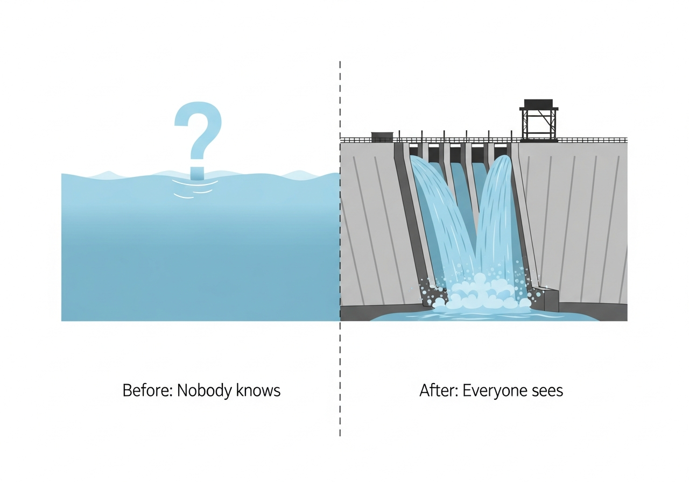
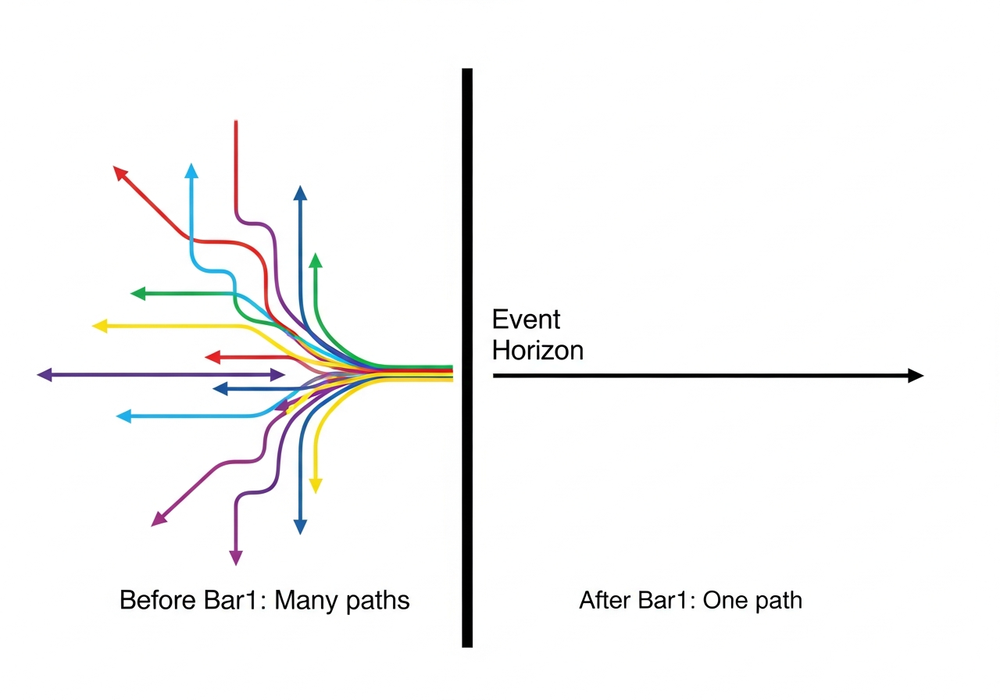
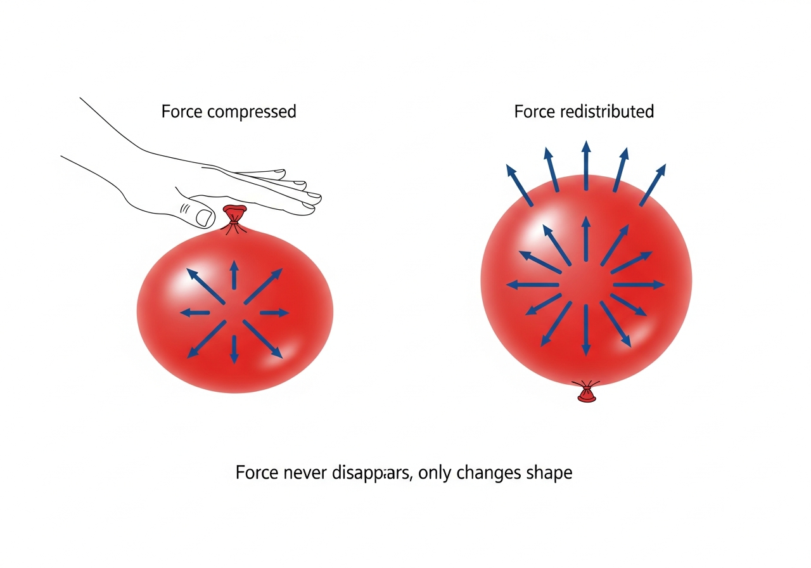
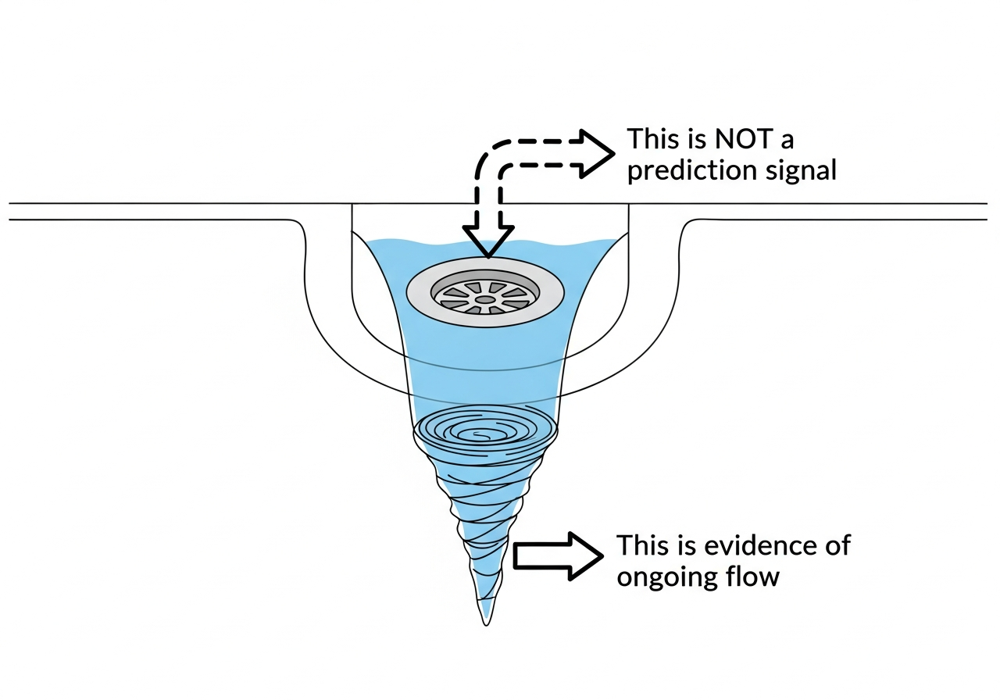
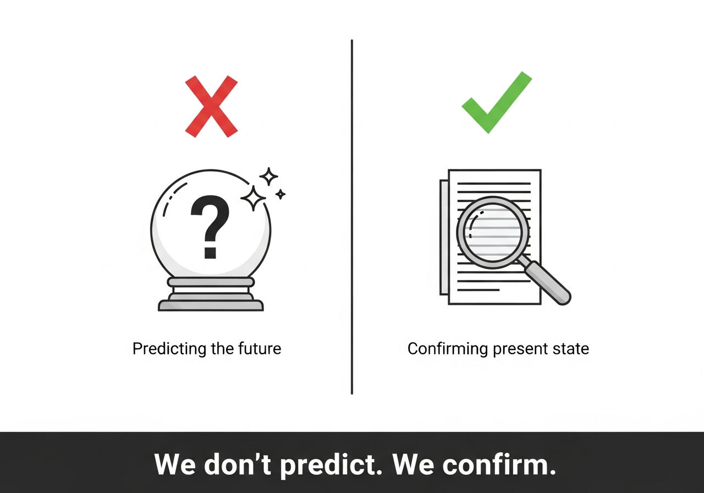

# V7 Observation Theory - Simple Guide

---

## 5 Core Sentences (Remember These Only)

1. **The market repeats the same structure over and over**
2. **No one knows when it will break**
3. **We can tell immediately when it breaks**
4. **Force doesn't disappear—it only changes shape**
5. **We only move after it breaks**

---

## Visual Explanations

### 1. Market Structure (One Image Summary)



```
Calm → Compressed → BURST (Bar1) → Settling → Calm again
```

The market is a cycle.
We only confirm **the moment it bursts.**

---

### 2. Why Prediction Is Impossible



Even when a dam is full of water, nothing changes until the moment it breaks.
Only after it breaks can we see the water flowing.

> **Before it breaks: no one knows.**
> **After it breaks: everyone sees.**

> 🔍 **Why we explained it this way**
>
> This is a translation of "only post-event observation is valid"
> into everyday language.
> This system does not attempt prediction.
> It only deals with states after information is confirmed.

---

### 3. Bar1 = The Event



Before crossing the black line (Bar1), many possibilities exist.
The moment you cross it, **only one remains.**

> Before this line = many paths
> After this line = one path

---

### 4. Force Never Disappears



Press a balloon and the air compresses.
Release it and the air spreads out.

> **Force doesn't vanish.**
> **It gathers, then disperses.**

---

### 5. The Vortex Is Not a Prediction Signal



When water drains from a sink, a whirlpool forms.
The whirlpool doesn't appear **before** the water drains.
It appears **while** the water is already draining.

> Whirlpool = not a cause
> Whirlpool = evidence that flow is already happening

---

### 6. What We Actually Do



```
❌ Predicting the future
⭕ Confirming the present state
```

> **We don't predict.**
> **We only confirm what has already happened.**

---

## Why This System Isn't a Scam

> **"This system wasn't built to make more money.**
> **It was built to lose less."**

> 🔍 **Why we explained it this way**
>
> Most trading systems claim to "make more money."
> This system is the opposite.
> It acknowledges that prediction is impossible,
> and aims to **fail fast and cheap** when wrong.

---

## One-Line Summary

**A system where mistakes are revealed immediately, so you don't die.**

- We don't try to be right → nothing to be wrong about
- We only confirm breaks → we only move when it's certain
- Force is conserved → it works like physics

---

### Theoretical Frames We Referenced (Conceptual Language Only)


The following theories were **not used as models** in this system.

They were referenced only as **conceptual language**
to explain why the observed structures are valid,
not to generate signals, probabilities, or predictions.

---

#### Relativity (Einstein)

- The idea that simultaneity depends on the observer  
- Explains why prior prediction is structurally impossible in markets  

We interpret:
- **Bar1** as an *event*  
- **DC = 1** as an *event horizon*  

Prices may change continuously,
but observable events become definite
only after a structural boundary is crossed.

---

#### Quantum Mechanics (Metaphorical Level Only)

- The distinction between pre-observation and post-observation states  

Before observation:
- Multiple paths coexist (superposition)

After observation:
- One realized path remains (collapse)

No quantum probabilities, wave functions,
or stochastic quantum models are used.

This system borrows **only the idea that observation fixes state**.

---

#### Fluid Dynamics

- Compression, dissipation, and vortex formation  

Used to interpret:
- **Force**
- **Delta**
- **Vortex**

A vortex is **not a signal**.
It is a region of energy transfer.

Market movement is observed
not as directional intent,
but as **energy redistribution**.

---

#### Systems Theory & Thermodynamics

- Irreversibility  
- Energy conservation  
- State transitions and cyclic behavior  

The market does not create new force.
It redistributes existing force across states.

---

### Additional Conceptual Foundations Used in Practice

The following frameworks were **actively used in reasoning and validation**,
even though no formal mathematical models were imported.

---

#### Information Theory

- Core concept: **information loss**

Irreversibility is defined
not by price magnitude,
but by **loss of reconstructible information**.

After Bar1:
- Prior states cannot be reconstructed
- Possible paths collapse to one
- Information entropy drops sharply

---

#### Statistical Mechanics

- Individual trades are ignored  
- Only distributions are observed  

Used tools:
- State-wise mean, variance, coefficient of variation  
- Quartile comparisons  
- Pre/post total energy comparison  

We never ask:
> “Why did this trade work?”

We only ask:
> “Does this state always produce the same distribution?”

---

#### Topological State-Space Thinking

- States are treated as **regions**, not points  
- Transitions occur by **boundary crossing**, not gradual drift  

Prices are continuous.
States are not.

**DC = 1** marks a topological transition.

---

#### Control Theory / State Machines

- The market is treated as an observable state machine  
- Not a system to be predicted or controlled  

Used concepts:
- State entry / exit  
- Allow / block  
- Post-event certification  

We do not move the market.
We only stop incorrect actions early.

---

#### Falsificationism (Popper-style)

- Hypotheses are never proven  
- They are only allowed to survive  

Failures are not patched.
They are absorbed, redefined, or eliminated.

This system did not remain
because it was correct,
but because **nothing could destroy it**.

---

### One-Line Clarification

We did not use these theories as models.

We observed data first.
These theories were used **only as language**
to describe structures that survived observation.


---

## Want to Go Deeper?

**Why do we keep failing to predict markets?**
→ [IRREVERSIBILITY.md](IRREVERSIBILITY.md)
→ [AXIOM — Irreversibility (Locked)](AXIOM_IRREVERSIBILITY.md)
**What exactly are we observing?**
→ [WHAT_WE_SEE.md](WHAT_WE_SEE.md)

**What happens after the market "breaks"?**
→ [TORNADO_MEDIATOR.md](TORNADO_MEDIATOR.md)

---

This guide explains *what* we see.
The documents that follow explain *why* this must be so.

---

*V7 Observation Theory - 2026*
