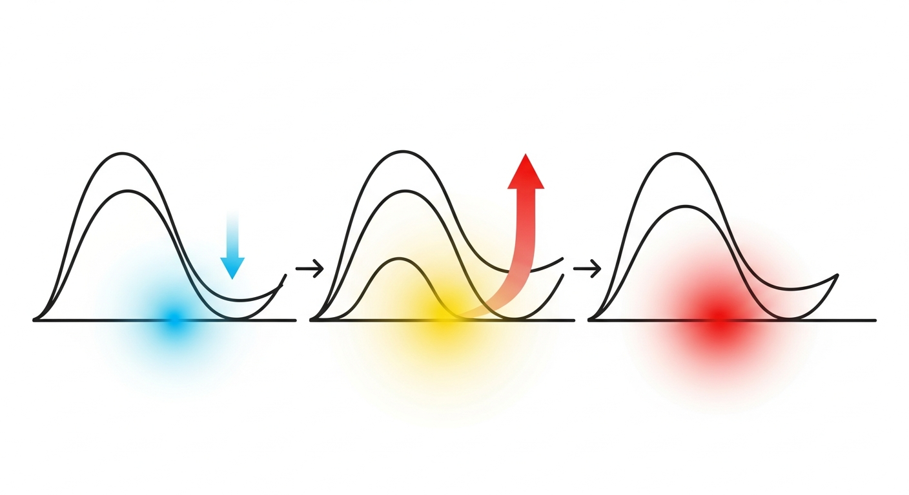
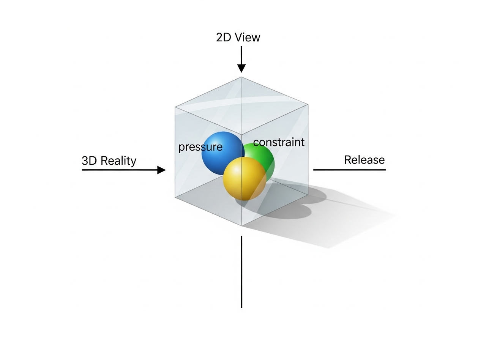

# What We See

> *This document answers one specific question.*
> *It does not explain the entire system.*

---

## We Look at Charts

We look at charts.
But charts are not the whole market.

The patterns we see are only **shadows** of invisible states.

---

## Why the Same Pattern Produces Different Results



Three waves exist.
They look identical.

But the results are:
- One ended small
- One exploded upward
- One barely moved

**Even if the surface looks the same, the force inside is different.**

> 🔍 **Why we explained it this way**
>
> This is a translation of "2D patterns are incomplete projections of 3D states"
> into everyday language.
> When the hidden state (Force, DC, Delta) differs within the same pattern,
> results varied by up to 18x.
> Patterns are not causes—they are **shadows.**

---

## The Invisible State Space



Inside a transparent box, three elements exist:
- **Pressure (Force)** – accumulated force
- **Constraint (DC)** – degree of restriction
- **Release (Delta)** – energy discharged

Looking down from above, it appears as **just a single line.**

We only see from above.
We can only know what's inside **after the event breaks.**

> 🔍 **Why we explained it this way**
>
> The 3D State Space belongs to the axiom layer.
> The 2D chart (price × time) we see is a projection of this 3D state.
> Information is lost during projection,
> and this is the **structural cause** of "same pattern, different result."
> Information loss is not a skill problem—it's a physical constraint.

---

## 🔬 Scientific Tools Used for Observation

This theory was validated using observational tools,
not predictive or optimization-based methods.

The primary tools were:

**Irreversible boundary detection**
Identifying state transitions where prior information cannot be recovered
(operationally observed at DC = 1, Bar1).

**Distributional analysis**
Comparing outcome distributions across state partitions
rather than fitting individual trajectories.

**State-space decomposition**
Representing market behavior in a multi-dimensional state space
(Pressure, Constraint, Release) instead of price-time coordinates.

**Energy conservation checks**
Verifying that aggregate force is redistributed across states
rather than created or destroyed.

**Hypothesis collapse testing**
Removing assumptions layer by layer
and retaining only structures that survive falsification.

No stochastic forecasting, curve fitting, or parameter optimization
was used to derive these conclusions.

---

## Why Patterns Fail

Patterns don't fail because **analysis was insufficient.**

Patterns **never existed independently** in the first place.

| What people think | Reality |
|:------------------|:--------|
| Patterns create results | States create results |
| Studying patterns more will help | Patterns alone lack information |
| I failed because I lack skill | I failed because information didn't exist |

> **Micro-patterns don't fail.**
> **They never existed independently.**

---

## What We Can Do as Observers

We don't predict.
We **confirm.**

```
❌ Try to guess the future
⭕ Confirm the current state
```

This explanation is close to a metaphor.
But being a metaphor doesn't make it inaccurate.
**By giving up prediction, we gain observational accuracy.**

---

# What We Actually Observed

(Empirical Observations Summary)

This system was not built on assumptions or predictions.
It was built on **what was repeatedly observed and experimentally verified.**

---

## 1. Irreversibility Exists

All meaningful signals occurred only **after** a specific boundary.
This boundary was consistently identified as **Bar1 (DC=1).**

- Before the boundary: multiple futures possible
- After the boundary: converges to one outcome

> **Observation:**
> Market state transitions are irreversible.
> Information needed to reconstruct the prior state is lost.

---

## 2. Prediction Is Structurally Impossible

All real-time prediction attempts failed.
This failure persisted regardless of instrument, regime, or parameters.

> **Observation:**
> Prediction fails not because of model limitations,
> but because it's a **property of the system itself.**

> 🔍 **Why we explained it this way**
>
> This is a translation of "only post-event observation is possible"
> into everyday language.
> This system doesn't attempt prediction.
> It only deals with states after information is confirmed.

---

## 3. Force Is Conserved, Not Created

Measured energy before and after state transitions maintained a stable ratio.
Force didn't disappear after events.
Instead, **it changed form** (compression → release).

> **Observation:**
> The market doesn't generate force.
> Force is only **redistributed** between states.

---

## 4. The Vortex Is Not a Signal

Regions previously interpreted as "chaotic" or "noisy"
actually showed **higher force transfer efficiency**, not randomness.
These regions amplified redistribution but did not determine direction or timing.

> **Observation:**
> The vortex is not a cause.
> It's a **state mediator**—a transmission structure.

---

## 5. Micro-Patterns Are Projections, Not Causes

Identical 2D patterns produced drastically different outcomes.
When grouped by 3D state, outcomes became consistent.
2D repetition was explained by 3D state circulation.

> **Observation:**
> Micro-patterns don't fail.
> **They never existed independently.**

---

# Interpreting These Observations

From these observations, a consistent structure emerged:

| Observation | Interpretation |
|:------------|:---------------|
| Bar1 | The only irreversible event |
| DC = 1 | Event horizon of state transition |
| Vortex | Mediator of force redistribution |
| State transitions | Energy is conserved |
| Observable patterns | Projections of hidden state space |

This system describes **how markets transition between states,**
not how prices move in the future.

---

# On the Use of Machine Learning

(State Estimation Only)

Machine learning is required to build an engine from this theory.
But you must understand this:

**ML is a "sensory organ," not a "brain."**

---

## The Exact Role of ML

```
ML = State Space Coordinate Estimator
```

ML does:
- Decision ❌
- Judgment ❌
- **Coordinate estimation** ⭕

---

## The Only Permitted Location for ML

```
Bar1 (Event)
     ↓
[ ML: State Estimation ]   ← Only ML location
     ↓
Vortex / Redistribution
     ↓
State Classification
```

ML is used **only after the event, before state classification.**

---

## What ML May vs. May Not Do

| ✅ Allowed | ❌ Forbidden |
|:-----------|:-------------|
| 3D coordinate estimation | Price prediction |
| State vector continuity | Direction decisions |
| Transition curvature approximation | Entry/exit timing |
| Cooldown distribution estimation | Policy learning |

---

## Permitted ML Types

```
✅ Autoencoder
✅ Representation Learning
✅ Contrastive Learning
✅ HMM (Hidden State Model)

❌ LSTM price prediction
❌ Classification (Buy/Sell)
❌ Reinforcement Learning
```

> 🔍 **Why we restricted this**
>
> The core of this system is "prediction is structurally impossible."
> If ML is allowed to predict, this axiom immediately collapses.
> ML must only be used as a tool for more precise state estimation.
> This is not a rule—it's a resolution issue.

---

## Warning

```
┌─────────────────────────────────────────────────────────────────────┐
│                                                                     │
│  ML is used for state estimation only.                             │
│  Any attempt to operationalize it for prediction                   │
│  invalidates the system.                                           │
│                                                                     │
└─────────────────────────────────────────────────────────────────────┘
```

---

## Core Summary

1. What we see is a shadow
2. The same shadow can have different contents
3. Trying to guess from shadows alone keeps failing
4. True state is only confirmed after the event breaks
5. We only move then
6. ML is a sensory organ, not a brain

---

## How This Was Observed

This theory was not derived from prediction,
optimization, or pattern fitting.

We used:

- Large-scale post-event aggregation
- State-based grouping instead of time-series forecasting
- Irreversible boundary detection (DC=1)
- Distributional comparison across state buckets
- Hypothesis collapse testing (remove-and-survive method)

No parameter tuning was allowed.
Any hypothesis that enabled prediction was rejected.

---

*V7 Observation Theory - WHAT_WE_SEE*
